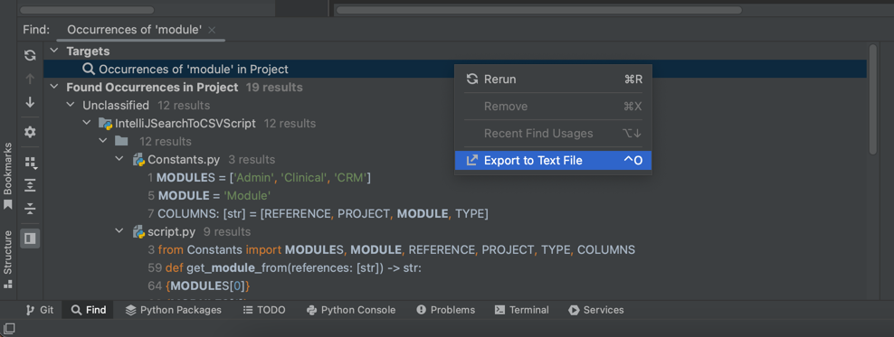

# IntelliJ Search To CSV Python Script

This python script converts a given text file through the command line formatted by indentation outputted by IntelliJ Search tool to a CSV file.

## Steps to Use

1. Search for some text in IntelliJ (Ctrl/Cmd + Shift + F) and click on 'Open in Find Window'

2. Right click anywhere and click 'Export to Text File'

3. Save it in the directory of this project

4. `cd` into the directory and run `python script.py <filename.txt>`
5. Open the generated .xlsx file with Microsoft Excel

## Example:

### Input:

### Output:

